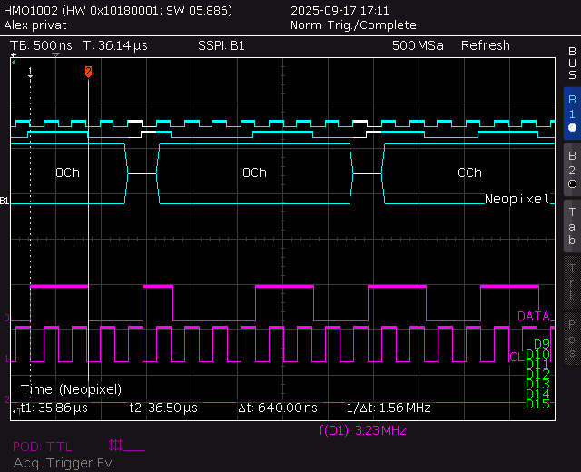

# NeoPixel SPI Driver Library for the Raspberry PI

This Python library provides an optimized SPI driver for controlling WS2812/SK6812 and 13 (NeoPixel) LED strips. It features efficient bit encoding that allows controlling up to 320 LEDs in a single SPI buffer transmission.

**In developement and not yet fully testet**

## Key Features

### Color Handling
- **Multiple Color Modes**:
  - RGB (Red, Green, Blue)
  - HSV (Hue, Saturation, Value)
  - YIQ (Luminance, In-phase, Quadrature)
  - HLS (Hue, Luminance, Saturation)

### LED Configuration
- **Flexible Color Order Support**:
  - RGB/GRB for WS2812
  - RGBW/GRBW for SK6812
  - Configurable pixel order to match different LED types

### Color Processing

- **Gamma Correction Functions**:
  - Linear (no correction)
  - Square gamma
  - 4th order polynomial (gamma4g)
  - Custom gamma interpolation support

### Performance
- Optimized SPI buffer encoding
- Support for different clock rates (400KHz, 800KHz, 1200KHz)
- Efficient bit-packing for reduced memory usage
- Handles up to 320 LEDs in a single buffer

### Additional Features
- Brightness control
- Auto-write mode
- Context manager support for safe resource handling
- Clean shutdown with automatic LED clearing

### If 320 pixels aren't enough
This driver handles larges sizes automatically. If you want more than 320 pixels, the SP driver nedds to switch the buffer, which may result in glitches now and then. If this is an issue, you can increase the SPI buffer size in the file /boot/firmware/cmdline.txt by adding spidev.bufsiz=<NEEDED BUFFER SIZE>.

### Bit encoding measurement
